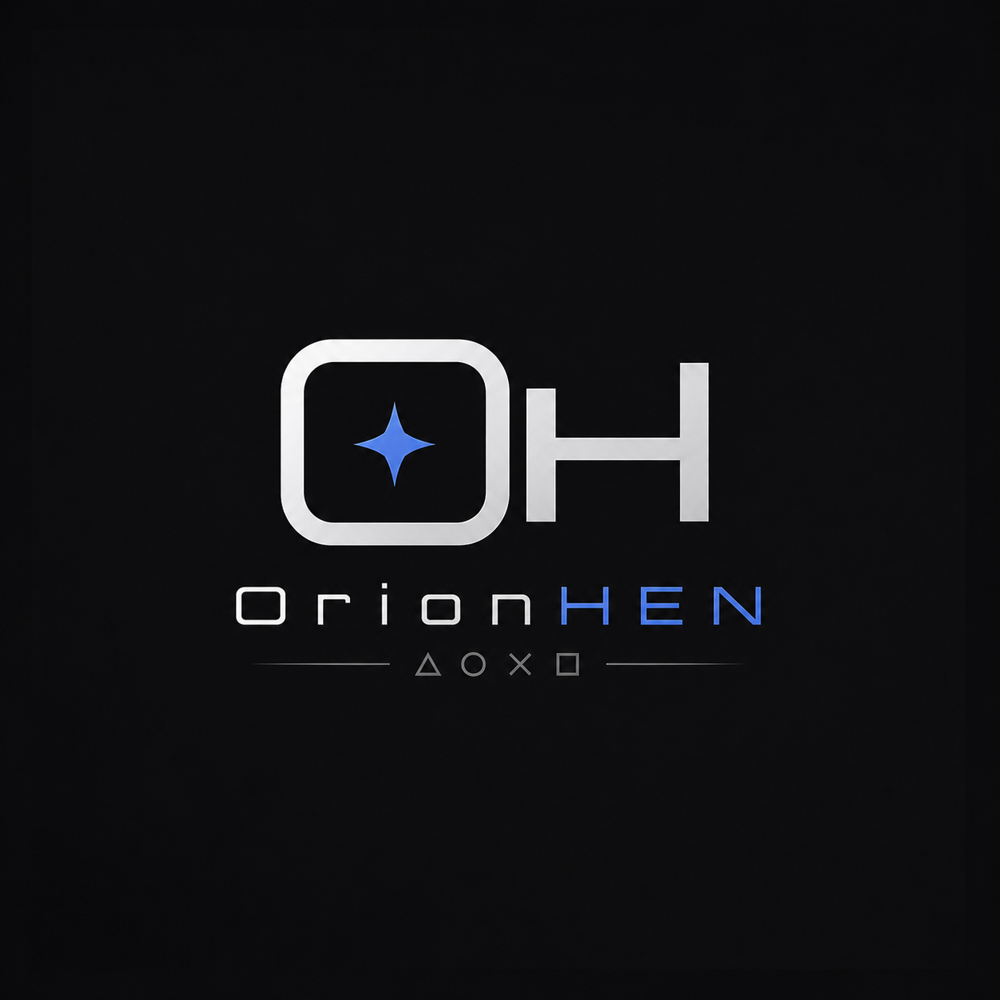

<p align="center">
  
</p>

<p align="center">
  <b>OnionHEN</b><br/>
  面向 PlayStation 5 的一体化自制程序启用器与 Toolbox
</p>

<p align="center">
  <b>简体中文</b>
  ·
  <a href="README.md">English</a>
</p>

<p align="center">
  <b><a href="#功能">功能</a></b>
  ·
  <b><a href="#运行">运行</a></b>
  ·
  <b><a href="#构建">构建</a></b>
  ·
  <b><a href="#配置">配置</a></b>
  ·
  <b><a href="#致谢">致谢</a></b>
</p>

---

<p align="center">
  <a href="LICENSE"></a>
  
  
  
  
</p>

<p align="center">
  OnionHEN 是一套模块化 PS5 payload 栈，将系统准备、ShellUI Toolbox、<br/>
  payload 管理、游戏 overlay、金手指和运行时服务整合在同一个入口 payload 中。
</p>

<p align="center">
  
</p>

<p align="center">
  
</p>

<p align="center">
  
</p>

<br>

# 功能

OnionHEN 致力于为已破解的 PS5 系统提供实用、可维护的自制程序运行环境。

- **ShellUI Toolbox** — 注入 PS5 ShellUI 的集成设置界面
- **系统准备** — 提权、文件系统重新挂载和系统更新分区阻断
- **fSELF / fPKG 支持** — 由内嵌 `kstuff` payload 提供可选内核能力
- **Payload 管理器** — 启动和停止裸 `.elf` payload，并支持自动启动
- **游戏 Overlay** — 可配置 FPS、CPU、GPU、RAM、温度、占用率和网络信息
- **金手指引擎** — 支持本地 JSON、SHN、MC4 和 ShnExt 文件及运行时开关
- **主机工具** — Rest Mode、Remote Play、外置硬盘、Title ID、风扇、快捷键和游戏选项
- **App Jailbreak** — 白名单自制程序可通过 daemon 沙盒 FIFO 请求提权
- **高可用运行时** — critical 与 utility 守护进程分离，主守护进程可自动拉起 utility
- **统一配置** — Toolbox 和守护进程共享同一套带版本号的 `config.ini` schema

OnionHEN 不内置内核 exploit。它仍然需要外部 **9021** `elfldr` 完成首跳
bootstrap，随后会启动自己的内置私有 **9020** loader，用于运行时 ELF 与用户
payload 加载。

<br>

# 运行

### 运行要求

1. 一台运行兼容内核 exploit 的 PS5
2. 一个监听 **9021** 端口、用于首跳 bootstrap 的外部 [PS5 `elfldr`](https://github.com/ps5-payload-dev/elfldr)
3. 需要 fSELF / fPKG 功能时，准备与固件兼容的 `kstuff`

> [!IMPORTANT]
> 固件与 exploit 兼容性由 exploit 链、PS5 Payload SDK 和 `kstuff` 版本共同决定。
> 不要假设为某一固件构建的 payload 可以安全地运行在其他固件上。

### 加载 OnionHEN

1. 运行内核 exploit，并启动外部 `elfldr` 服务。
2. 通过 exploit host 提供的 loader 发送 `OnionHEN.elf`。
3. 等待 utility daemon、`kstuff` 和 main daemon 依次启动。
4. 打开 PS5 设置区域访问 OnionHEN Toolbox。

运行时启动顺序经过有意串行化。bootstrap 之后，OnionHEN 会优先使用内置
`onion_elfldr.elf` 的 **9020** 端口，并保留 **9021** 作为兼容 fallback。

```text
OnionHEN.elf → bootstrapper → onion_elfldr.elf (:9020) → util.elf → kstuff.elf → daemon.elf → Toolbox
```

### Payload

将独立 payload 放到：

```text
/data/OnionHEN/payloads/
```

仅支持裸 `.elf` payload。可以在 Toolbox 中启用自动启动；OnionHEN 会通过同名
`.auto_start` 标记文件保存这个选择。

### 金手指

按照 Title ID 和游戏版本，将金手指文件放到 flat 目录：

```text
/data/OnionHEN/cheats/<TITLE_ID>_<VERSION>.json
/data/OnionHEN/cheats/<TITLE_ID>_<VERSION>.shn
/data/OnionHEN/cheats/<TITLE_ID>_<VERSION>.mc4
/data/OnionHEN/cheats/<TITLE_ID>_<VERSION>.ShnExt
```

金手指文件从本地加载，文件变化后无需重启完整运行栈即可检测并重新载入。

<br>

# 构建

### 依赖

| 依赖 | 用途 |
| --- | --- |
| [PS5 Payload SDK](https://github.com/ps5-payload-dev/sdk) | Prospero 编译器、目标头文件、运行库和 CMake wrapper |
| CMake 3.20+ 与 Ninja | 配置并构建 payload 依赖图 |
| Clang / LLVM | 编译 `x86_64-sie-ps5` 目标 |
| `lzma` 或 `xz` | 压缩 bootstrapper |
| Git 与 `curl` 或 `wget` | 初始化 submodule 并获取外部 payload 输入 |

### 完整构建

```shell
git submodule update --init --recursive

export PS5_PAYLOAD_SDK=/path/to/ps5-payload-sdk
./scripts/build.sh --jobs 8
```

构建脚本会配置项目、同步外部依赖，并按照正确顺序完成整个嵌入链构建。

### 常用选项

| 选项 | 说明 |
| --- | --- |
| `--fw <hex>` | 设置 `PS5_FW_VERSION` / `V_FW` |
| `--build-type Debug\|Release` | 选择 CMake 构建类型 |
| `--build-dir <path>` | 覆盖默认的 `build/` 目录 |
| `--cache-dir <path>` | 覆盖 `.cache/dependencies/` |
| `--stub-missing` | 使用仅供编译的外部 ELF 占位文件，禁止在真机使用 |
| `--skip-unpacker` | 构建完 bootstrapper 后停止 |
| `--init-submodules` | 同步依赖前初始化 submodule |

运行 `./scripts/build.sh --help` 查看完整选项列表。

### 构建产物

| 路径 | 说明 |
| --- | --- |
| `build/bin/OnionHEN.elf` | 发送到主机的最终 payload |
| `build/bin/bootstrapper.elf` | 未压缩的 bootstrapper |
| `build/bin/bootstrapper.elf.lzma` | 嵌入最终 payload 的 bootstrapper |
| `build/bin/daemon.elf` | Critical daemon |
| `build/bin/util.elf` | Utility daemon |
| `build/bin/shellui.elf` | Toolbox 注入 payload |
| `build/lib/*.a` | 第一方静态库 |

所有生成文件都位于 `build/`；下载的输入缓存在 `.cache/dependencies/`。
`source/` 不再作为构建产物目录使用。

### 测试

Host tests 覆盖配置、IPC framing、payload helper、金手指解析、指令重定位、Toolbox 路由和共享平台代码：

```shell
make -C source/util/tests clean
make -C source/util/tests test -j8
```

Host tests 链接阶段要求通过 `KEYSTONE_PREFIX` 找到 Keystone，默认路径为 `/opt/homebrew`。

<br>

# 配置

OnionHEN 通过以下两个运行时视图创建并共享同一套配置 schema：

```text
/data/OnionHEN/config.ini
/user/data/OnionHEN/config.ini
```

大部分设置都可以直接在 Toolbox 中修改。新的语义化 schema 从
`schema_version=1` 开始。如果没有配置文件，OnionHEN 会释放一份基于
[`config.ini.example`](config.ini.example) 的带注释默认配置。

| 配置项 | 默认值 | 可用值 |
| --- | --- | --- |
| `meta.schema_version` | `1` | `1` |
| `toolbox.language` | `system` | `system`, `zh-Hans`, `en` |
| `startup.open_after_load` | `none` | `none`, `home_menu` |
| `home_screen.show_title_ids` | `false` | `true`, `false` |
| `game_menu.show_onionhen_options` | `true` | `true`, `false` |
| `rest_mode.resume_reinject_delay_seconds` | `0` | 秒数 |
| `rest_mode.stop_utility_daemon_on_entry` | `false` | `true`, `false` |
| `rest_mode.close_running_game_on_entry` | `false` | `true`, `false` |
| `cheats.memory_backend` | `default` | `default`, `libhijacker` |
| `app_jailbreak.debug_notifications` | `false` | `true`, `false` |
| `cooling.fan_control` | `automatic` | `automatic`, `temperature_threshold` |
| `cooling.temperature_threshold_celsius` | `77` | `0` 到 `100` |
| `overlay.edge` | `top` | `top`, `bottom` |
| `overlay.show_cpu` / `overlay.show_gpu` / `overlay.show_memory` | `true` | `true`, `false` |
| `overlay.cpu_usage_mode` | `average` | `average`, `per_core` |
| `overlay.show_ip_address` | `false` | `true`, `false` |
| `shortcuts.cheats_menu` | `off` | `off`, `r3_l3`, `l2_triangle`, `long_options`, `long_share`, `share` |
| `shortcuts.toolbox` | `off` | `off`, `l2_r3`, `long_share`, `share` |

### 运行时数据

| 路径 | 用途 |
| --- | --- |
| `/data/OnionHEN/payloads/` | 用户 payload ELF |
| `/data/OnionHEN/cheats/` | Flat 金手指文件 |
| `/data/OnionHEN/kstuff.elf` | 可选的内嵌 `kstuff` 运行时覆盖文件 |
| `/data/OnionHEN/OnionHEN.log` | 主运行日志 |
| `/data/OnionHEN/OnionHEN_util_daemon.log` | Utility daemon 日志 |

<br>

# 主机侧工具

| 工具 | 用途 |
| --- | --- |
| [`scripts/daemon_log.py`](scripts/daemon_log.py) | 从主机串流 daemon 日志 |
| [`scripts/shutdown_onion.py`](scripts/shutdown_onion.py) | 关闭 OnionHEN userland 栈但不终止 `kstuff` |
| [`scripts/ps5_cmake.sh`](scripts/ps5_cmake.sh) | 通过 PS5 Payload SDK 运行 CMake |
| [`scripts/sync_dependencies.sh`](scripts/sync_dependencies.sh) | 获取或构建外部 payload 输入 |

<br>

# 仓库结构

```text
.
├── assets/                    项目图片资源
├── docs/                      架构与技术文档
├── scripts/                   构建、依赖和主机侧辅助脚本
├── source/                    第一方 PS5 源码树
│   ├── bootstrapper/          启动与内嵌 payload 链
│   ├── daemon/                Critical daemon 与 Toolbox 注入
│   ├── util/                  Utility daemon、IPC 与金手指引擎
│   ├── shellui/               Toolbox 与 ShellUI hooks
│   ├── unpacker/              最终 OnionHEN payload wrapper
│   ├── libonion_*/            第一方共享库
│   ├── common/                共享底层实现
│   └── platform/ps5/stubs/    PS5 系统库链接 stub
├── third_party/               外部源码、预编译库和 submodule
├── tools/                     仓库侧生成工具
├── build/                     生成的构建产物（忽略提交）
└── .cache/dependencies/       下载的外部输入（忽略提交）
```

完整模块与 IPC 关系见[架构文档](docs/arch.md)。

<br>

# 故障排查

1. 加载 OnionHEN 前确认外部首跳 `elfldr` 服务可通过 **9021** 端口访问。
2. 确认 payload 使用完整 PS5 Payload SDK 为目标固件构建。
3. Toolbox 没有出现时，请等待串行的 `util → kstuff → daemon` 启动链并检查日志。
4. 完整构建无法获取 `kstuff.elf` 时，重试 `./scripts/sync_dependencies.sh` 或初始化 submodule。
5. 报告问题时请附带固件、exploit host、SDK 版本、构建类型、日志和稳定复现步骤。

<br>

# 参与贡献

- 保持改动聚焦，并遵循现有 snake_case 命名约定。
- 同步上游代码时保留第三方文件名。
- 提交 pull request 前运行完整 PS5 构建和 host tests。
- 修改模块职责、IPC、运行时路径或依赖时同步更新 `docs/arch.md`。

<br>

# 致谢

OnionHEN 离不开 PS5 自制程序与逆向工程社区的共同努力。

- [etaHEN](https://github.com/LightningMods/etaHEN) — LightningMods 与贡献者；本项目最初的开源基础
- [GoldHEN](https://github.com/GoldHEN/GoldHEN) — SiSTR0 与贡献者；成熟一体化 HEN 的灵感来源
- [PS5 Payload SDK](https://github.com/ps5-payload-dev/sdk) 与 PS5 payload 开发社区
- [kstuff-lite](https://github.com/EchoStretch/kstuff-lite) — EchoStretch、sleirsgoevy 与贡献者
- [cJSON](https://github.com/DaveGamble/cJSON)、[7-Zip SDK](https://www.7-zip.org/sdk.html) 与 Keystone
- 所有 OnionHEN 贡献者、测试者、研究人员，以及提供有效反馈的用户

<br>

# 许可证

本项目基于 [GNU General Public License v3.0](LICENSE) 发布。
第三方组件保留各自的许可证与声明。

> OnionHEN 是非官方自制程序项目，与 Sony Interactive Entertainment 无隶属关系。
> 请仅在你拥有的硬件上使用，风险由使用者自行承担。本项目不提供任何担保。
